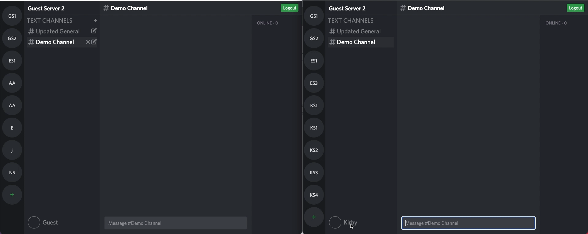
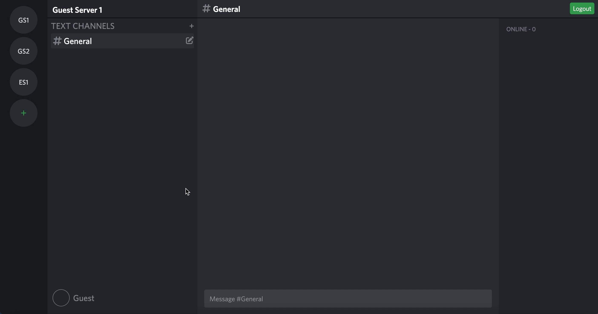
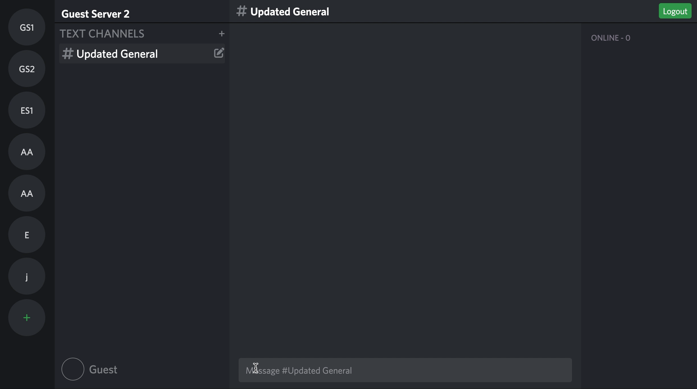

# Accord
[Accord](https://accord-app-1.herokuapp.com/#/) is a clone of the instant messaging platform, Discord. Using Accord, users are able to create servers and channels, and can communicate with each other via group messaging.

## Technologies Utilized

Frontend
+ React
+ CSS
+ Redux

Backend
+ PostgreSQL
+ Rails

Live Chat
+ Action Cable

## Key Features

### Live Chat

Users can instant message each other through channels located within servers.

### Channels

Users can create, update, and delete channels in servers that they've created. They can also view others' servers and channels.

### Servers

Users can create and view servers.

## Future Plans

+ Search for server
+ Friends list
  + Add Friend
  + DM between friends
+ Profile Images
